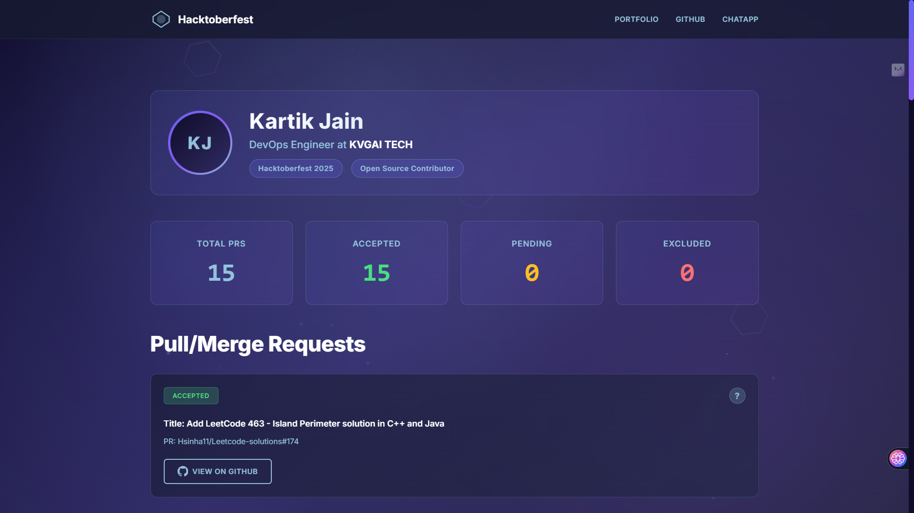

# Hacktoberfest Profile Dashboard 2025



A modern, animated web application showcasing my Hacktoberfest 2025 contributions, built with React and Framer Motion. This interactive dashboard displays all my pull requests and contributions made during Hacktoberfest 2025.

## What is Hacktoberfest?

**Hacktoberfest** is an annual month-long celebration of open-source software run by DigitalOcean, GitHub, and other partners. During October, developers worldwide are encouraged to contribute to open-source projects through pull requests. It's a fantastic opportunity to:

- Give back to the open-source community
- Learn new skills and technologies
- Connect with developers around the world
- Earn limited-edition rewards and swag

Whether you're a beginner or an experienced developer, Hacktoberfest welcomes everyone to participate in the spirit of open source!

Learn more at: [https://hacktoberfest.com/](https://hacktoberfest.com/)

## About This Project

This is a personal portfolio dashboard that showcases my Hacktoberfest 2025 journey. The website features:

- **Animated UI**: Smooth animations powered by Framer Motion
- **Pull Request Showcase**: Display of all my accepted PRs during Hacktoberfest 2025
- **Statistics Dashboard**: Overview of total contributions and achievements
- **Responsive Design**: Fully responsive across all devices
- **Modern Stack**: Built with React 19, Vite, and modern web technologies

## Features

- Interactive animated background
- Real-time statistics of contributions
- Detailed PR cards with status indicators
- Smooth page transitions and animations
- Professional profile section
- Direct links to all pull requests on GitHub
- Clean and modern UI design

## Tech Stack

- **Framework**: React 19.1.1
- **Build Tool**: Vite 7.1.7
- **Animation**: Framer Motion 12.23.24
- **Styling**: Custom CSS with animations
- **Linting**: ESLint with React plugins

## Getting Started

### Prerequisites

- Node.js (v16 or higher)
- npm or yarn package manager

### Installation

1. Clone the repository:
```bash
git clone https://github.com/Kartikk-26/hacktoberfest-profile.git
cd hacktoberfest-profile
```

2. Install dependencies:
```bash
npm install
```

3. Start the development server:
```bash
npm run dev
```

4. Open your browser and navigate to `http://localhost:5173`

### Build for Production

```bash
npm run build
```

The production-ready files will be in the `dist` directory.

### Preview Production Build

```bash
npm run preview
```

## Project Structure

```
hacktoberfest-profile/
├── src/
│   ├── components/
│   │   ├── AnimatedBackground.jsx    # Animated background component
│   │   ├── Header.jsx                # Header component
│   │   ├── Profile.jsx               # Profile information
│   │   ├── Stats.jsx                 # Statistics dashboard
│   │   └── PRCard.jsx                # Pull request card component
│   ├── data/
│   │   └── prData.js                 # Pull request data
│   ├── App.jsx                       # Main application component
│   ├── App.css                       # Global styles
│   ├── index.css                     # Base styles
│   └── main.jsx                      # Application entry point
├── index.html
├── package.json
└── vite.config.js
```

## My Hacktoberfest 2025 Contributions

This dashboard showcases **15 accepted pull requests** contributed during Hacktoberfest 2025, including:

- LeetCode problem solutions in C++ and Java
- Bug fixes and improvements to open-source projects
- Algorithm implementations and data structure solutions
- Documentation and code quality improvements

View all contributions in detail at [https://github.com/Kartikk-26](https://github.com/Kartikk-26)

## Connect With Me

- **Portfolio**: [https://www.tech.kartik.sbs/](https://www.tech.kartik.sbs/)
- **GitHub**: [https://github.com/Kartikk-26](https://github.com/Kartikk-26)
- **LinkedIn**: [https://www.linkedin.com/in/-kartikjain/](https://www.linkedin.com/in/-kartikjain/)

## About Me

I'm **Kartik Jain**, a DevOps Engineer at KVGAI TECH, passionate about open-source contributions, cloud technologies, and building innovative solutions. I actively participate in the developer community and love contributing to projects that make a difference.

## Contributing

While this is a personal portfolio project, feel free to:

- Fork the repository
- Use it as a template for your own Hacktoberfest profile
- Submit issues or suggestions
- Star the repo if you find it useful!

## License

This project is open source and available for anyone to use as a template for their own Hacktoberfest portfolio.

## Acknowledgments

- Thanks to all the open-source maintainers who reviewed and accepted my PRs
- [Hacktoberfest](https://hacktoberfest.com/) for organizing this amazing event
- The open-source community for their continuous support and inspiration

---

**Built with ❤️ for Hacktoberfest 2025 | Open Source Contribution**

*Made by Kartik Jain*
